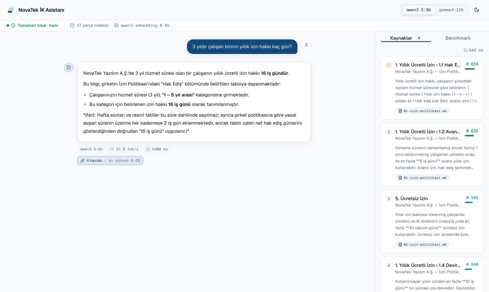
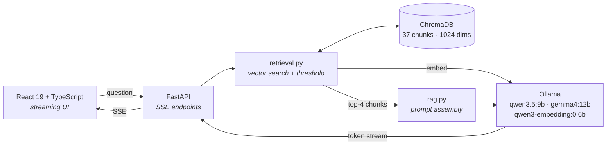

<div align="center">

# NovaTek HR Assistant

**A fully local RAG system that answers questions from internal company
documents — and the LLM benchmarking harness behind it.**

Neither the question nor the answer leaves the machine. There are no external
API calls.

[](https://www.python.org/)
[](https://fastapi.tiangolo.com/)
[](https://www.trychroma.com/)
[](https://ollama.com/)
[](https://react.dev/)
[](https://www.typescriptlang.org/)
[](https://tailwindcss.com/)

[](#verification)
[](#verification)
[](#quick-start)
[](#security-and-privacy)
[](LICENSE)
[](https://github.com/Yigtwxx/local-llm-rag-hr-assistant/commits/main)

<picture>
  <source media="(prefers-color-scheme: dark)" srcset="docs/images/ui-dark.png">
  
</picture>

<sub>Every answer sits next to the passages that produced it and their
similarity scores — so the user can trust the source, not the answer.</sub>

<sub>The interface is in Turkish; the knowledge base is a set of fictional
Turkish HR policies.</sub>

</div>

---

## Why

Personnel files, salary bands and performance notes are exactly the data that
cannot be sent to a cloud provider. This project shows that a question-answering
system touching that data can be built without anything leaving the machine —
and measures what it costs.

**The measurement found the opposite of what was expected.** At this scale,
running a comparable model in the cloud costs roughly ₺600/year, while the
electricity alone for the local setup runs ₺1,700–5,800. Local is **not
cheaper** for this workload. Rather than bury that, the project changed its
thesis: a local deployment is not a cost saving but a **measurable privacy
premium**. The report states exactly how much that premium is.

## Highlights

| | |
|---|---|
| **Grounded answers** | Every answer ships with the passages it used and their cosine similarity scores. Both the score and the text are on screen — no "trust me". |
| **Refusal over invention** | Two layers of defence: a similarity threshold (0.46) and the system prompt. Even when an out-of-scope question clears the threshold, the model declines — confirmed six times across two models × three runs. |
| **Retrieval measured, not assumed** | A gold-labelled harness scores retrieval on its own — where the answering passage ranks, and whether it reaches the model at all. It found two questions the answer-quality benchmark scored as passes. |
| **Two-armed retrieval** | A BM25 arm recovers passages the vector search ranks too low, and can only *add* to what the vector arm already found. Dense results, their order and the refusal guarantee are untouched by construction. |
| **Answerable follow-ups** | The chips under an answer are written at ingest and reviewed by hand, so every one of them has a passage behind it. No extra model call, no suggestion the assistant would then refuse. |
| **Live model comparison** | Switch models in the header and re-ask the same question. The comparison is a usable feature, not a table in a report. |
| **Per-model interface** | The two models carry two distinct visual languages — colour, corner radius, elevation, brand mark. You can tell which one you are on without reading a label. |
| **Contamination-aware benchmarks** | The harness unloads foreign models from Ollama before a run and watches for new ones during it. Two runs were invalidated this way instead of quietly reaching the report. |

## Architecture



Everything runs on `localhost`; no arrow leaves the machine.

## Quick start

**Requirements:** [Ollama](https://ollama.com/download) ≥ 0.32 ·
Python ≥ 3.12 (via [`uv`](https://docs.astral.sh/uv/)) · Node.js ≥ 20

```bash
# 1 — Pull the models (~15 GB, one-off)
ollama pull qwen3.5:9b            # 6.6 GB — primary chat model
ollama pull gemma4:12b            # 7.6 GB — comparison model
ollama pull qwen3-embedding:0.6b  # 639 MB — embedding model

# 2 — Index the knowledge base (one-off)
cd backend && uv run python -m app.ingest    # 4 documents → 37 chunks

# 3 — Start everything
./scripts/dev.sh                             # Windows: scripts\dev.bat
```

The UI opens by itself once it is ready. Backend at <http://127.0.0.1:8000>
(OpenAPI under `/docs`), frontend at <http://localhost:5173>.

<details>
<summary><b>Running it manually / what the script does</b></summary>

<br>

`scripts/dev.sh` brings both servers up together, streams their logs into one
terminal tagged by source, and tears them down as a group — Ctrl+C applies to
both, and if one crashes the other follows. Before starting it checks that
`uv`/`npm` exist, that the ports are free and that the index is built, so a
problem surfaces as one line rather than a traceback.

```bash
BACKEND_PORT=8001 ./scripts/dev.sh   # on a port conflict
NO_OPEN=1 ./scripts/dev.sh           # do not open a browser
```

By hand:

```bash
# terminal 1
cd backend && uv run uvicorn app.api:app --reload

# terminal 2
cd frontend && npm install && npm run dev
```

To change settings, copy `.env.example` to `.env`. It runs on the defaults, so
this step is optional.

</details>

## Run with Docker

Two containers — the API and the built UI behind nginx. **Ollama stays on the
host**: inside a container it cannot reach Metal on macOS, so it would fall back
to CPU and the numbers below would no longer describe this system.

```bash
# 1 — Ollama running on the host, with the models pulled (see Quick start)
ollama serve

# 2 — From the repository root
docker compose up --build
```

| | |
|---|---|
| <http://localhost:8180> | UI |
| <http://localhost:8100/docs> | OpenAPI |

The index is built inside the container on first start (a few minutes) and kept
in the `chroma-storage` volume; later starts take seconds. `docker compose down
-v` throws it away and forces a rebuild.

Ports 8180 and 8100 were picked to stay clear of 8000/5173, which `dev.sh` uses.
Override them in `.env`:

```bash
WEB_PORT=9180
BACKEND_HOST_PORT=9100
```

Two notes. Docker is not needed for development — `./scripts/dev.sh` is the
faster loop, with hot reload on both sides. And **stop the stack before running
a benchmark** (`docker compose down`): a second container holding a model in
Ollama contaminates the measurement, which is how runs 8 and 9 were lost.

## Benchmark results

Apple M4 Pro · 48 GB unified memory · aggregate of three clean runs.
Both models receive byte-for-byte identical prompts with the same
`temperature`, `seed`, `num_predict` and `think` values.

| Metric | `qwen3.5:9b` | `gemma4:12b` |
|---|---:|---:|
| Throughput (token-weighted) | **37.35 ± 0.46** tok/s | 27.65 ± 0.27 tok/s |
| Time to first token (median) | **1,941 ms** | 2,978 ms |
| Memory (Ollama `/api/ps`) | **6.29 GB** | 7.85 GB |
| Answer accuracy | 14/14 | 14/14 |
| Grounding fidelity | 11/11 | 11/11 |
| Retrieval (model-independent) | 82 – 102 ms | 82 – 102 ms |

The two models tie on quality and grounding; they separate on speed and
memory. For this workload `qwen3.5:9b` is 35% faster and needs 1.5 GB less.

Retrieval belongs to the embedding model, not the chat model, which is why it
is reported as a single figure. The range given is the per-run median; the
**first** query after startup can take 0.1–8.6 s because the embedding model is
being loaded into memory at that moment. That is a real cost, not noise.

<details>
<summary><b>How it was measured</b></summary>

<br>

- **tok/s** — `Σ tokens / Σ generation time`, from Ollama's `eval_count` /
  `eval_duration` counters. Per-case mean and standard deviation are reported
  separately: a single average hides within-run variance.
- **TTFT** — time to the first token, median.
- **Memory** — the model size Ollama reports via `/api/ps`. Process RSS is
  recorded too but is unreliable because of `mmap` (see research report §9.4).
- **Quality** — pass/fail via keyword matching.
- **Grounding fidelity** — how often an out-of-scope question is declined
  instead of answered from invention.

```bash
cd backend
uv run python -m bench.run_bench                    # reasoning off (default)
uv run python -m bench.run_bench --think            # reasoning on
uv run python -m bench.calibrate_threshold          # calibrate the similarity threshold
uv run python -m bench.run_bench --output run.json  # do not overwrite latest.json
```

Retained runs:

| File | Threshold | Note |
|---|---|---|
| `run4-clean` · `run5-reversed` · `run6-repeat` | 0.52 | Three clean runs; the speed/TTFT/memory figures above come from these |
| `run8-clean` · `run9-reversed` | 0.46 | Another application loaded a 23 GB model into Ollama mid-run — the harness flagged it and the speed figures were **discarded** |
| `run10-repeat` | 0.46 | The one fully clean run after the threshold change; confirms 4–6 |
| `run11-think` | 0.46 | Reasoning mode on — secondary finding |
| `run3-memory-pressure` | 0.52 | First run, taken with the uncorrected RAM measurement; kept for comparison |

</details>

## Design decisions

<details>
<summary><b>Why the similarity threshold is 0.46, not 0.52</b></summary>

<br>

0.52 was calibrated on long questions and rejected short ones such as "How much
is the per-diem?" — 4 of 19 in-scope questions. 0.46 is the highest value that
misses none of them. In exchange, 2 of 9 out-of-scope questions clear the
threshold and reach the system prompt, where the second layer declines them.
No single threshold both catches everything in scope and filters everything
out of scope, which is why the defence has two layers.

</details>

<details>
<summary><b>Why <code>think=False</code> is sent explicitly on every call</b></summary>

<br>

Reasoning is on by default in `qwen3.5` and off in `gemma4`. Left to the
defaults, one model would emit thinking tokens and the other would not, which
invalidates any speed comparison. The value is sent explicitly on every request.

</details>

<details>
<summary><b>Why chunking preserves the heading hierarchy</b></summary>

<br>

In an HR document "16 working days" means nothing on its own; the heading it
sits under is what fixes its meaning. `chunking.py` prepends the document title
and section path to every chunk, so the embedding carries that context too. The
UI shows the same section path on each source card — four chunks from one policy
would otherwise be indistinguishable by document title alone.

</details>

## Verification

```bash
cd backend  && uv run ruff check . && uv run ruff format --check . && uv run pytest
cd frontend && npm run typecheck && npm run lint && npm test && npm run build
```

## Known limitation

For the question **"How many days is paternity leave?"** the chunk that
literally contains the answer used to rank 12th of 37 (score 0.419), never reach
the top-4, and get declined. That one is fixed: a BM25 arm now carries it to the
model on the strength of a word that appears in exactly one chunk of the corpus.
Questions whose answer reaches the model went from 17/19 to 18/19, with no
change to any other question's passages and nothing added to out-of-scope
questions.

The instrument built to measure that fix found a second case, and it is still
open. **"Is unused leave carried over?"** — the answering passage ranks 5th at
score 0.520, *above* the threshold, so no amount of threshold tuning would ever
have surfaced it; only a rank-aware metric could. BM25 does not rescue it
either: the question says *devri*, the document says *devredilir*. Turkish
agglutination defeats exact token matching, and fixed-length prefix truncation
does not separate the cases cleanly. The right fix is a Turkish stemmer, and it
was not added without first measuring what it does to out-of-scope leakage.

Details and numbers: research report §9.9 and §9.10.

## Project layout

<details>
<summary><b>File tree</b></summary>

<br>

```
backend/
  app/
    config.py        Settings from environment variables (nothing hardcoded)
    chunking.py      Markdown chunking that preserves heading hierarchy
    ingest.py        Chunk → embed → write to ChromaDB
    retrieval.py     Vector search + similarity threshold + BM25 arm
    lexical.py       BM25 word search, Turkish-aware tokenizer
    suggestions.py   Reviewed follow-up questions, keyed by passage
    gen_suggestions.py  Drafts those questions for a human to review
    llm.py           Ollama HTTP client, retry + streaming
    rag.py           Retrieve → assemble prompt → stream answer
    api.py           FastAPI endpoints (SSE)
    prompts/         Prompt templates (not embedded in code)
  bench/
    run_bench.py         Model comparison: speed, memory, answer quality
    eval_retrieval.py    Retrieval quality: Recall@4, MRR, did it reach the model
    calibrate_threshold.py  Threshold sweep over the labelled question set
  tests/             pytest unit tests
frontend/
  src/
    lib/api.ts       Typed SSE client
    lib/modelSkin.ts Per-model visual identity
    components/      Chat, source cards, benchmark panel
data/
  kb/                Fictional HR documents (the knowledge base)
  suggested-questions.yaml  Follow-up chips — generated, then reviewed by hand
scripts/             dev.sh · dev.bat — bring both servers up together
```

</details>

## Documents

| File | Contents |
|---|---|
| [`docs/arastirma-raporu.md`](docs/arastirma-raporu.md) | Research report (Turkish) — hardware, quantization, cost analysis, measurement methodology |
| [`docs/proje-raporu.md`](docs/proje-raporu.md) | Project report (Turkish) — design rationale, results, limitations |
| [`docs/slides/index.html`](docs/slides/index.html) | Slide deck (opens in a browser, print to PDF with Cmd/Ctrl+P) |
| `backend/bench/results/` | Raw benchmark output (JSON) |

## Security and privacy

- No external API calls; everything runs on `localhost`.
- The knowledge base and vector store stay local (`backend/storage/`, git-ignored).
- No secrets in source; all settings are read from environment variables.
- The documents under `data/kb/` are **fictional** and do not represent a real company.

## License

[MIT](LICENSE) — © 2026 Yiğit ERDOĞAN
