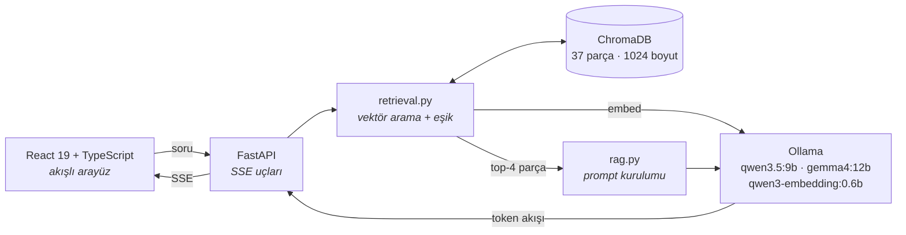

<div align="center">

# NovaTek İK Asistanı

**Şirket içi dokümanlara dayanarak cevap veren, tamamen lokal çalışan RAG sistemi
— ve onu besleyen LLM kıyaslama altyapısı.**

Soru da cevap da makineden çıkmaz. Hiçbir harici API çağrısı yoktur.

[](https://www.python.org/)
[](https://fastapi.tiangolo.com/)
[](https://react.dev/)
[](https://www.typescriptlang.org/)
[](https://ollama.com/)
[](#doğrulama)

[**Türkçe**](README.md) · [English](README.en.md)

<picture>
  <source media="(prefers-color-scheme: dark)" srcset="docs/images/ui-dark.png">
  
</picture>

<sub>Her cevabın yanında onu üreten parçalar ve benzerlik skorları duruyor —
kullanıcı cevaba değil, kaynağa güvenebilsin diye.</sub>

</div>

---

## Neden

Özlük dosyaları, maaş bantları ve performans notları buluta gönderilemeyen
verilerdir. Bu proje, o verilere dokunan bir soru-cevap sisteminin makineden
hiç çıkmadan kurulabileceğini gösteriyor — ve maliyetini ölçüyor.

**Ölçümün ortaya çıkardığı şey beklenenin tersiydi.** Aynı sınıf bir modeli
bulutta çalıştırmak bu ölçekte yılda ~600 TL; lokal kurulumun yalnızca
elektriği 1.700–5.800 TL. Yani lokal çalıştırmak bu iş yükünde **daha ucuz
değil**. Proje bunu gizlemek yerine tezini değiştirdi: lokal kurulum bir
tasarruf kalemi değil, **ölçülebilir bir gizlilik primidir**. Ne kadar
ödendiği raporda sayılarla duruyor.

## Öne çıkanlar

| | |
|---|---|
| **Kaynağa bağlı cevap** | Her cevap, dayandığı parçalarla ve kosinüs benzerlik skorlarıyla birlikte gelir. Skor da metin de ekranda; "güven bana" yok. |
| **Uydurmayı reddetme** | İki savunma katmanı: benzerlik eşiği (0,46) ve sistem prompt'u. Kapsam dışı soru eşiği geçse bile model reddediyor — iki model × üç koşuda altı kez de doğrulandı. |
| **Canlı model kıyası** | Sağ üstten model değiştirip aynı soruyu tekrar sorabilirsiniz. Kıyas rapordaki bir tablo değil, kullanılabilir bir özellik. |
| **Modele göre arayüz** | İki model iki ayrı görsel dil taşır — renk, köşe yarıçapı, gölge derinliği, marka işareti. Hangi modelde olduğunuz etikete bakmadan anlaşılır. |
| **Kirlenmeyi yakalayan ölçüm** | Harness, koşu öncesi Ollama'daki yabancı modelleri boşaltır ve koşu boyunca izler. Ölçümlerin ikisi bu sayede geçersiz sayıldı — sessizce rapora girmedi. |

## Mimari



Tamamı `localhost` üzerindedir; hiçbir ok makinenin dışına çıkmaz.

## Hızlı başlangıç

**Gereksinimler:** [Ollama](https://ollama.com/download) ≥ 0.32 ·
Python ≥ 3.12 ([`uv`](https://docs.astral.sh/uv/) ile) · Node.js ≥ 20

```bash
# 1 — Modelleri indir (~15 GB, tek seferlik)
ollama pull qwen3.5:9b            # 6,6 GB — birincil sohbet modeli
ollama pull gemma4:12b            # 7,6 GB — karşılaştırma modeli
ollama pull qwen3-embedding:0.6b  # 639 MB — embedding modeli

# 2 — Bilgi tabanını indeksle (tek seferlik)
cd backend && uv run python -m app.ingest    # 4 doküman → 37 parça

# 3 — Her şeyi başlat
./scripts/dev.sh                             # Windows: scripts\dev.bat
```

Arayüz hazır olduğunda kendiliğinden açılır. Backend
<http://127.0.0.1:8000> (`/docs` altında OpenAPI), arayüz
<http://localhost:5173>.

<details>
<summary><b>Elle başlatmak / betiğin ne yaptığı</b></summary>

<br>

`scripts/dev.sh` iki sunucuyu birlikte ayağa kaldırır, loglarını kaynak
etiketiyle tek terminale akıtır ve ikisini tek grup olarak kapatır — Ctrl+C
biri için değil ikisi için geçerlidir, biri çökerse diğeri de iner.
Başlamadan önce `uv`/`npm` var mı, portlar boş mu, indeks kurulu mu diye
bakar; hata bir traceback olarak değil tek satır olarak çıkar.

```bash
BACKEND_PORT=8001 ./scripts/dev.sh   # port çakışırsa
NO_OPEN=1 ./scripts/dev.sh           # tarayıcıyı açma
```

Elle yürütmek isterseniz:

```bash
# terminal 1
cd backend && uv run uvicorn app.api:app --reload

# terminal 2
cd frontend && npm install && npm run dev
```

Ayar değiştirmek için `.env.example` dosyasını `.env` olarak kopyalayın.
Varsayılanlarla çalıştığından bu adım zorunlu değildir.

</details>

## Ölçüm sonuçları

Apple M4 Pro · 48 GB birleşik bellek · üç temiz koşunun birleşimi.
Her iki model de baytı baytına aynı prompt'ları, aynı `temperature`, `seed`,
`num_predict` ve `think` değerleriyle alır.

| Metrik | `qwen3.5:9b` | `gemma4:12b` |
|---|---:|---:|
| Üretim hızı (token ağırlıklı) | **37,35 ± 0,46** tok/s | 27,65 ± 0,27 tok/s |
| İlk cevap (TTFT, medyan) | **1.941 ms** | 2.978 ms |
| Bellek (Ollama `/api/ps`) | **6,29 GB** | 7,85 GB |
| Cevap doğruluğu | 14/14 | 14/14 |
| Kaynağa sadakat | 11/11 | 11/11 |
| Retrieval (modelden bağımsız) | 82 – 102 ms | 82 – 102 ms |

Kalite ve sadakatte iki model eşit; ayrışma hız ve bellekte. Bu iş yükü için
`qwen3.5:9b` %35 daha hızlı ve 1,5 GB daha az bellek istiyor.

Retrieval embedding modeline aittir, sohbet modelinden bağımsızdır — bu yüzden
tek sayı olarak raporlanır. Verilen aralık koşu medyanlarıdır; başlangıçtan
sonraki **ilk** sorgu 0,1–8,6 s sürebilir, çünkü embedding modeli o sırada
belleğe yükleniyor. Bu bir gürültü değil, gerçek bir maliyet.

<details>
<summary><b>Nasıl ölçüldü</b></summary>

<br>

- **token/s** — `Σ token / Σ üretim süresi`, Ollama'nın `eval_count` /
  `eval_duration` sayaçlarından. Vaka ortalaması ve standart sapma ayrıca
  raporlanır: tek bir ortalama koşu içi değişkenliği gizler.
- **TTFT** — ilk token'a kadar geçen süre, medyan.
- **Bellek** — Ollama'nın `/api/ps` raporundaki model boyutu. Süreç RSS'i de
  kaydedilir ama `mmap` nedeniyle güvenilir değildir (ayrıntı: araştırma
  raporu Bölüm 9.4).
- **Kalite** — anahtar kelime eşleşmesiyle geçti/kaldı.
- **Kaynağa sadakat** — kapsam dışı soruda uydurmadan reddetme oranı.

```bash
cd backend
uv run python -m bench.run_bench                    # reasoning kapalı (varsayılan)
uv run python -m bench.run_bench --think            # reasoning açık
uv run python -m bench.calibrate_threshold          # benzerlik eşiğini kalibre et
uv run python -m bench.run_bench --output run.json  # latest.json'ın üzerine yazma
```

Saklanan koşular:

| Dosya | Eşik | Not |
|---|---|---|
| `run4-clean` · `run5-reversed` · `run6-repeat` | 0,52 | Üç temiz koşu; yukarıdaki hız/TTFT/bellek sayıları buradan |
| `run8-clean` · `run9-reversed` | 0,46 | Ölçüm sırasında başka bir uygulama Ollama'ya 23 GB'lık model yükledi — harness uyardı, hız sayıları **kullanılmadı** |
| `run10-repeat` | 0,46 | Eşik değişikliği sonrası tek tamamen temiz koşu; 4–6'yı doğrular |
| `run11-think` | 0,46 | Reasoning modu açık — ikincil bulgu |
| `run3-memory-pressure` | 0,52 | Düzeltilmemiş RAM ölçümüyle alınan ilk koşu; karşılaştırma için tutuluyor |

</details>

## Mimari kararlar

<details>
<summary><b>Benzerlik eşiği neden 0,52 değil 0,46</b></summary>

<br>

0,52 uzun sorularla kalibre edilmişti ve "Harcırah ne kadar?" gibi kısa
soruları reddediyordu — 19 kapsam içi sorunun 4'ünü. 0,46, sıfır kaçırma
sağlayan en yüksek değer. Karşılığında 9 kapsam dışı sorunun 2'si eşiği geçip
sistem prompt'una düşüyor; ikinci katman onları da reddediyor. Tek eşikle
hem kaçırmamak hem kapsam dışını elemek mümkün değil, o yüzden savunma iki
katmanlı.

</details>

<details>
<summary><b>Neden <code>think=False</code> her çağrıda açıkça gönderiliyor</b></summary>

<br>

`qwen3.5`'te reasoning varsayılan olarak açık, `gemma4`'te kapalı. Varsayılana
bırakılsaydı bir model düşünme token'ları da üretecek, diğeri üretmeyecekti —
hız kıyası geçersiz olurdu. Değer her istekte açıkça gönderiliyor.

</details>

<details>
<summary><b>Parçalama başlık hiyerarşisini neden koruyor</b></summary>

<br>

Bir İK dokümanında "16 iş günü" ifadesi tek başına anlamsızdır; hangi başlığın
altında geçtiği anlamı belirler. `chunking.py` her parçaya doküman başlığını ve
bölüm yolunu ekliyor, böylece embedding bağlamı da taşıyor. Arayüz kaynak
kartlarında aynı bölüm yolunu gösteriyor — aynı politikadan gelen dört parça
yalnızca doküman adıyla birbirinden ayırt edilemezdi.

</details>

## Doğrulama

```bash
cd backend  && uv run ruff check . && uv run ruff format --check . && uv run pytest
cd frontend && npm run typecheck && npm run lint && npm test && npm run build
```

## Sınırlar

Dürüstçe: **"Babalık izni kaç gün?"** sorusunda cevabı birebir içeren parça 37
parça arasında 12. sırada (skor 0,419) kalıyor, top-4'e giremiyor ve sistem
soruyu reddediyor. Dense retrieval'ın klasik kelime dağarcığı uyuşmazlığı
sorunu; standart çözümü hibrit arama (BM25 + vektör).

Düzeltilmedi, çünkü indeksi yeniden kurmak altı koşuluk ölçümü ve eşik
kalibrasyonunu geçersiz kılardı. Devam edilirse ilk iş budur.

## Proje yapısı

<details>
<summary><b>Dosya ağacı</b></summary>

<br>

```
backend/
  app/
    config.py        Ortam değişkenlerinden ayarlar (hardcode yok)
    chunking.py      Başlık hiyerarşisini koruyan Markdown parçalama
    ingest.py        Parçala → göm → ChromaDB'ye yaz
    retrieval.py     Vektör arama + benzerlik eşiği
    llm.py           Ollama HTTP istemcisi, retry + streaming
    rag.py           Getir → prompt kur → akışlı cevap
    api.py           FastAPI uçları (SSE)
    prompts/         Prompt şablonları (kod içine gömülü değil)
  bench/             Kıyaslama ve eşik kalibrasyon araçları
  tests/             pytest birim testleri
frontend/
  src/
    lib/api.ts       Tipli SSE istemcisi
    lib/modelSkin.ts Modele göre görsel kimlik
    components/      Sohbet, kaynak kartları, benchmark paneli
data/kb/             Kurgusal İK dokümanları (bilgi tabanı)
scripts/             dev.sh · dev.bat — iki sunucuyu birlikte kaldırır
```

</details>

## Dokümanlar

| Dosya | İçerik |
|---|---|
| [`docs/arastirma-raporu.md`](docs/arastirma-raporu.md) | Araştırma raporu — donanım, quantization, maliyet analizi, ölçüm metodolojisi |
| [`docs/proje-raporu.md`](docs/proje-raporu.md) | Proje raporu — mimari gerekçeler, sonuçlar, sınırlar |
| [`docs/slides/index.html`](docs/slides/index.html) | Sunum (tarayıcıda açılır, Cmd/Ctrl+P ile PDF'e basılır) |
| `backend/bench/results/` | Ham benchmark çıktıları (JSON) |

## Güvenlik ve gizlilik

- Hiçbir harici API çağrısı yapılmaz; tüm işlem `localhost` üzerindedir.
- Bilgi tabanı ve vektör deposu yereldedir (`backend/storage/`, git'e girmez).
- Kaynak kodda gizli anahtar bulunmaz; tüm ayarlar ortam değişkenlerinden okunur.
- `data/kb/` altındaki dokümanlar **kurgusaldır**, gerçek bir şirketi temsil etmez.
